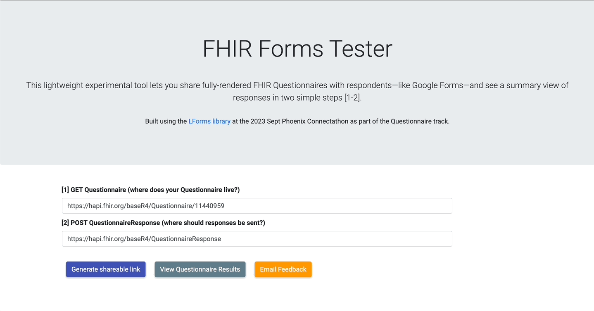

# FHIR Forms Tester

## This lightweight experimental tool lets you share fully-rendered FHIR Questionnaires with respondents—like Google Forms—and see a summary view of responses in two simple steps [1-2].

### Built using the LForms library at the 2023 Sept Phoenix Connectathon as part of the Questionnaire track.

- [1] GET Questionnaire (where does your Questionnaire live?)

- [2] POST QuestionnaireResponse (where should responses be sent?)

## Setup

- Run the demo [here](https://fhirforms-1d1ea7b0526a.herokuapp.com/)
- Run locally using `flask run` after installing packages

